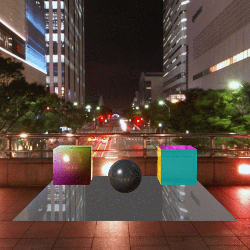

# キューブマッピング
6枚のテクスチャを立方体に組み合わせたキューブマップを写りこませます。

# 課題
次の問題に挑戦してみてください。

- 物体毎に移りこむ強さを変えてみよう

# 課題の進め方
次のように課題を解いてみてください。

- プロジェクトをforkします
- GitHub Pages の機能を使って、ホームページを立ち上げます
- 問題を解きます
- GitHub Pages で正答したか確認しましょう

